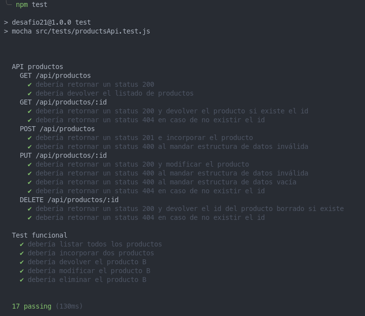

# Desafío 21 - Programación Backend

### CoderHouse

## TESTEAMOS NUESTRA API REST

Retomemos nuestro trabajo para realizar test de algunas de las funcionalidades que tenemos en la API REST.

### Consigna

Revisar en forma completa el proyecto entregable que venimos realizando, refactorizando y reformando todo lo necesario para llegar al esquema de servidor API RESTful en capas planteado en esta clase.

Asegurarse de dejar al servidor bien estructurado con su ruteo / controlador, negocio, validaciones, persistencia y configuraciones (preferentemente utilizando en la codificación clases de ECMAScript).

No hace falta realizar un cliente ya que utilizaremos tests para verificar el correcto funcionamiento de las funcionalidades desarrolladas.

- Desarrollar un cliente HTTP de pruebas que utilice Axios para enviar peticiones, y realizar un test de la funcionalidad hacia la API Rest de productos, verificando la correcta lectura de productos disponibles, incorporación de nuevos productos, modificación y borrado.

- Realizar el cliente en un módulo independiente y desde un código aparte generar las peticiones correspondientes, revisando los resultados desde la base de datos y en la respuesta del servidor obtenida en el cliente HTTP.

- Luego, realizar las mismas pruebas, a través de un código de test apropiado, que utilice mocha, chai y Supertest, para probar cada uno de los métodos HTTP de la API Rest de productos.

- Escribir una suite de test para verificar si las respuestas a la lectura, incorporación, modificación y borrado de productos son las apropiadas. Generar un reporte con los resultados obtenidos de la salida del test.

### Ejecución

Luego de clonar o descargar el repositorio e instalar todas las dependencias con `npm install`, existen dos comandos para levantar el proyecto.
Para levantarlo en modo de desarrollo junto a nodemon, utilizar `npm run dev`. De lo contrario, para ejecutarlo en "modo producción", utilizar `npm start`.

Se puede pasar por parámetros de argumento dos opciones:
| Opción | Valor | Defecto |
| ------ | ----------------------- | --------------------------------------------------------------------------------------------------------------------------------------------------------------------------------------------------------------------------- |
| `-p --port --PORT` | Número de puerto de escucha del servidor | 8080 |
| `-m --mode --MODE` | Módo de ejecución del servidor. `FORK` o `CLUSTER` | FORK |

Se puede seleccionar entre cuatro métodos de **persistencia de datos** a través de la variable de entorno `PERS`.

| Key             | Descripción                                               |
| --------------- | --------------------------------------------------------- |
| `mem`           | Persistencia en memoria del servidor (Opción por defecto) |
| `file`          | Persistencia usando el sistema de archivos                |
| `mongodb`       | Persistencia en base de datos MongoDB local               |
| `mongodb_atlas` | Persistencia en base de datos MongoDB Atlas               |

Esta selección se hace pasando el valor correspondiente de la key en la variable de entorno `PERS` a la hora de levantar el servidor.
La forma de hacerlo depende de la terminal que se esté ejecutando. Un ejemplo desde linux sería:

```sh
$ PERS=mongodb_atlas node .
```

### Vistas

Existen las siguientes vistas que proveen una manera amena de probar el desafío.
Estas vistas se encuentran en las rutas:

- **/** : es la vista principal en donde se encuentra el formulario de carga de productos y el centro de mensajes (chat). Utiliza **websockets**. Requiere autenticación.

- **/login** : formulario de login.

- **/login-error** : vista a la que redirige tras un error en el login.

- **/register** : formulario de registro.

- **/register-error** : vista a la que redirige tras un error en el login.

- **/logout** : vista a la que se accede tras hacer el logout y luego de 5 segundos redirige a home.

- **/productos-mock** : es donde se muestra en una tabla el mock de productos devueltos por la llamada a la API en la ruta de test. Requiere autenticación

- **/info**: muestra información relativa a la app

### API

Consiste en las siguientes rutas:

##### Router /api/productos

| Método | Endpoint                | Descripción                                                        |
| ------ | ----------------------- | ------------------------------------------------------------------ |
| GET    | **/api/productos/**     | Me permite listar todos los productos disponibles                  |
| POST   | **/api/productos/**     | Para incorporar productos al listado                               |
| GET    | **/api/productos/:id**  | Me permite listar un producto por su id                            |
| PUT    | **/api/productos/:id**  | Actualiza un producto por su id. Admite actualizaciones parciales  |
| DELETE | **/api/productos/:id**  | Borra un producto por su id                                        |
| GET    | **/api/productos-test** | Devuelve un listado de 5 productos mock generados con **Faker.js** |

#### Router /api/randoms

| Método | Endpoint         | Descripción                                                                                                                                                                                                                 |
| ------ | ---------------- | --------------------------------------------------------------------------------------------------------------------------------------------------------------------------------------------------------------------------- |
| GET    | **/api/randoms** | Devuelve una cantidad de números aleatorios en el rango del 1 al 1000 especificada por parámetros de consulta (query). Por ej: `/api/randoms?cant=20000`. Si dicho parámetro no se ingresa, calcula 100.000.000 de números. |

### Tests

Se puede ejecutar una suite de tests con **Mocha** de la **API de productos**.  
Para ello, utilizar el comando `npm test`, con el servidor corriendo bajo un entorno de `test`,de lo contrario, los test arrojarán error de autenticación.  
Un ejemplo desde linux para ejecutar los test con **MongoDB** como persistencia, sería:

Ejecución del servidor

```sh
$ NODE_ENV=test PERS=mongodb npm start
```

Ejecución del test

```sh
$ npm test
```

A modo de prueba y comparación, se hizo un test funcional manual que se puede ejecutar con el comando `npm run test-manual`, con la misma salvedad respecto al entorno de ejecución del servidor.

### Detalles y comentarios

Contemplo un tercer entorno de ejecución `test` que hace algunos cambios en la lógica de autenticación de la app a fin de evitar el problema sobre las rutas de la API que requieren autenticación.  
Básicamente, deshabilito el middleware de autenticación sobre la ruta de `api/productos` si `NODE_ENV=test` para aislar el tema del login del usuario en los tests, ya que no es su objetivo.

A fin de generar datos de productos para el test utilicé el módulo de **faker** para construir una función generadora que se importa para los tests.

En primer lugar, como pide el enunciado a fin de demostrar y comparar la potencia de realizar test con un framework de testeo, realicé una serie de tests manuales encadenados que se deben verificar con el estado en la base de datos junto a los resultados por consola (`manualHttpClientTest.js`). Este test utiliza el cliente htttp **AXIOS** para realizar las peticiones. Generé un modulo separado (`axiosHttpClient.js`) que exporta las funciones para realizar los diferentes tipos de peticiones, pasándole los respectivos argumentos.

Finalmente realicé una serie de tests con el framework de testeo **Mocha** junto con **supertest** como cliente http y **chai** para escribir las aserciones.  
Los tests se dividen en dos grupos principales:

- Test a endpoints de la API de productos: Se prueba cada endpoint según los distintos tipos de respuestas en función del estado de la petición.
- Test funcional de la API de productos: Se hace una simulación encadenada de peticiones, probando la funcionalidad en conjunto de la API. Es similar al recorrido que se hace en el test "manual".

En los test se usan los hooks de **before** y **after** para preparar las condiciones previas a los bloque de pruebas y luego para realizar una limpieza de los datos residuales (Ej: productos creados en BD)

Dentro de la carpeta `tests` se encuentra en un archivo .png donde se muestra una captura de pantalla de los resultados arrojados por consola.

<br/>
<div align="center">
  
</div>
